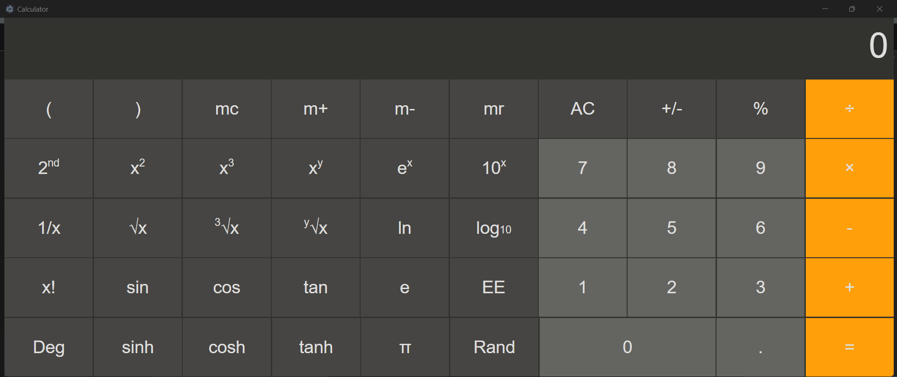
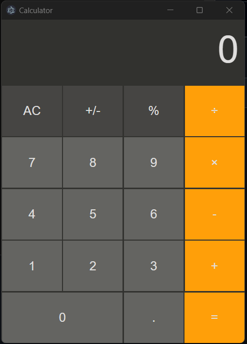

# Mac-Like Calculator Desktop App



A fully functional, cross-platform, Mac-like calculator built using HTML, CSS, JavaScript, Express, and Electron. This calculator provides both basic and scientific calculation features, wrapped in a sleek and intuitive interface.

## Features

- **Basic Calculations**: Perform standard arithmetic operations like addition, subtraction, multiplication, and division.
- **Scientific Calculations**: Access advanced mathematical functions such as trigonometry, logarithms, exponents, and more.
- **Memory Functions**: Support for memory storage, addition, subtraction, and recall.
- **Degree/Radian Toggle**: Switch between degree and radian modes for trigonometric functions.
- **Keyboard Support**: Allows you to perform calculations using keyboard shortcuts.
- **Resizable Window**: Adjust the window size as needed, with a predefined minimum and maximum height.

## Technology Stack

- **Frontend**: HTML, CSS, JavaScript
- **Backend**: Node.js, Express
- **Desktop Integration**: Electron

## Installation and Setup

1. **Clone the repository**:
    ```bash
    git clone https://github.com/your-username/calculator-app.git
    cd calculator-app
    ```

2. **Install dependencies**:
    ```bash
    npm install
    ```

3. **Start the application**:
    ```bash
    npm run start-both
    ```
    This will start both the server and the Electron app concurrently.

## Project Structure

- `main.js`: Main entry point for the Electron application.
- `server.js`: Server logic to handle back-end operations.
- `start.js`: Script to start both the server and Electron app concurrently.
- `public/`: Contains the frontend files (HTML, CSS, JS).
- `public/index.html`: The main interface of the calculator.
- `public/style.css`: Stylesheet for the calculator interface.
- `public/script.js`: Frontend logic for the calculator functionalities.
- `package.json`: Project configuration and dependencies.

## Screenshots

### Basic Mode


### Scientific Mode


## Contributing

Contributions are welcome! Feel free to open issues or submit pull requests for enhancements and bug fixes.

## License

This project is licensed under the ISC License - see the [LICENSE](LICENSE) file for details.

## Author

**Aniruddha Ghosh**
- [GitHub](https://github.com/aniruddha2004)
- [LinkedIn](https://www.linkedin.com/in/aniruddha-ghosh-87428824b/)

---

If you find this project helpful or use it in your own projects, feel free to leave a ⭐ on the repository!
